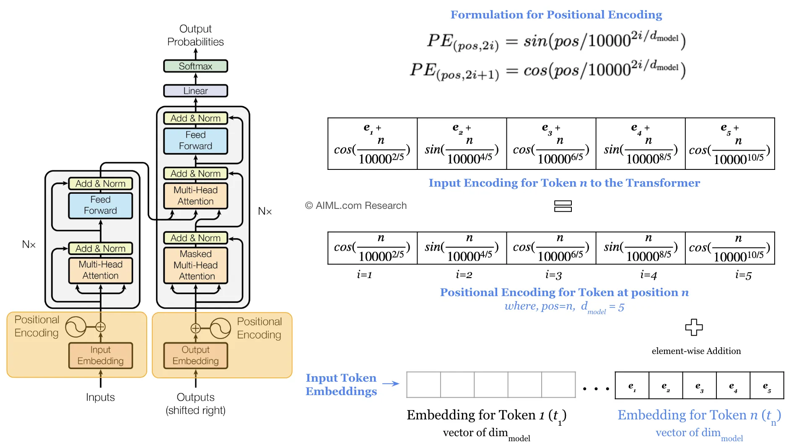

## 1. How Many Parameters in Network?

Consider a 2-layered network.
- Layer 1: Convolutional with `kernel_size` $5 * 5$, `padding` = 1, `stride` = 2
- Layer 2: Fully-connected
- `in_channels` = 3
- `hidden_channels` = 7
- `out_feat` = 2
- `input_size` of image = $h * w = 12 * 12$

**What is the total no. of learnable parameters?**

CNN:
- We have 3 kernels for each input channel and 7 hidden channels, so $3 * 5 * 5 * 7 = 525$ weights
- Each output channel has 1 bias, so in total $7$ bias parameters
- Total: $525 + 7 = 532$

FCN:
- First we calculate the new input size after CNN using $Hp = Wp = 1 + (H + 2 * padding - K) // stride = 1 + (12 + 2 * 1 - 5) // 2 = 5$
- So the FCN receives as input images of $5 * 5$ and 7 channels, which gets flattened
- The weight matrix has $5 * 5 * 7 = 175$ rows and $2$ columns 
- Since the no. of output features is 2, we have $175 * 2 = 350$ weight parameters and 2 biases
- Total: $350 + 2 = 352$

The total learnable parameters for all layers is $532 + 352 = 884$


## 2. Computing MLE for Poisson Distribution

Given the Poisson distribution:

$$ P_{model}(X = x) = \frac{\lambda^xe^{-\lambda}}{x!} $$

We draw $m$ samples: {$x_1, x_2, ..., x_m$}. The objective is to find the MLE for parameter $\lambda$ as a function of data samples.

**Write down the likelihood function for the given probability distribution.**

This is simply the product of the PDF for the observed values.

$$ L(\lambda, x_1, ..., x_m) = \prod_{j=1}^m{\frac{\lambda^x_je^{-\lambda}}{x_j!}} $$


**Write the log-likelihood function by using the logarithm operator on the function obtained in previous step.**

Hint: the log-likelihood is defined as:

$$ MLE(X) = argmax_{\theta} \prod_{1=1}^m{log(P_{model}(x_i, \theta))} $$

where $X$ = {${x_1...x_m}$}

$$ L(\lambda, x_1, ..., x_m) = ln(\prod_{j=1}^m{\frac{\lambda^x_je^{-\lambda}}{x_j!}}) $$

$$ = \sum_{j=1}^m{ln(\frac{\lambda^x_je^{-\lambda}}{x_j!})} $$

$$ = \sum_{j=1}^m{[x_j ln(\lambda) - \lambda - ln(x_j!)]} $$

$$ = -m\lambda + ln(\lambda)\sum_{j=1}^m{x_j} - \sum_{j=1}^m{ln(x_j!)} $$

**Calculate the derivative of the natural log likelihood function with respect to $\lambda$.**

$$ \frac{d}{d\lambda} L(\lambda, x_1, ..., x_m) $$

$$ = \frac{d}{d\lambda} ({-m\lambda + ln(\lambda)\sum_{j=1}^m{x_j} - \sum_{j=1}^m{ln(x_j!)} } ) $$

$$ = -m + \frac{1}{\lambda} \sum_{j=1}^m{x_j} $$

**Set the derivative equal to 0 and solve for $\lambda$.**

$$ -m + \frac{1}{\lambda} \sum_{j=1}^m{x_j} = 0 $$

$$ \lambda_{ML} = \frac{1}{m} \sum_{j=1}^m{x_j} $$


## 3. Receptive Field in CNN

Calculate the receptive field of a feature/pixel in the output of the architecture given by the table below.

Note: the RF refers to the no. of pixels in the input image that a particular feature ("pixel") in the output of Conv4 is looking at i.e. the answer should be a single integer.

See this awesome blogpost on RF arithmetic: https://medium.com/syncedreview/a-guide-to-receptive-field-arithmetic-for-convolutional-neural-networks-42f33d4378e0.

| Layer | Kernel size | Stride |
|----------|----------|----------|
| Conv1   | 3    | 1    |
| Pool1    | 2    | 2    |
| Conv2    | 3    | 1    |
| Pool2    | 2    | 2    |
| Conv3    | 3    | 1    |
| Conv4    | 3    | 1    |

We use the following formulas:

$$ j_{out} = j_{in} * s $$
which refers to distance between two adjacent features (i.e. cumulative stride).

$$ r_{out} = r_{in} + (k-1) * j_{in} $$

which is the RF of current layer.

For the above net:
- $r_0 = 1$ and $j_0 = 1$
- $r_1 = 1 + (3 - 1) * 1 = 3$ and $j_1 = 1 * 1 = 1$
- $r_2 = 3 + (2 - 1) *  1 = 4$ and $j_2 = 1 * 2 = 2$
- $r_3 = 4 + (3 - 1) * 2 = 8$ and $j_3 = 2 * 1 = 2$
- $r_4 = 8 + (2 - 1) * 2 = 10$ and $j_4 = 2 * 2 = 4$
- $r_5 = 10 + (3 - 1) * 4 = 18$ and $j_5 = 4 * 1 = 4$
- $r_6 = 18 + (3 - 1) * 4 = 26$ and $j_6 = 4 * 1 = 4$

So total no. of pixels seen by 1 pixel in the feature map produced by Conv4 is $26^2 = 676$


## 4. Batch Normalization

**What is batch normalization?**

Batch normalization is a technique that addresses the problem of internal covariate shift, which refers to the change in the distribution of network activations during training.

During training, batch normalization normalizes the activations of each mini-batch by subtracting the mini-batch mean and dividing by the mini-batch standard deviation. This helps to stabilize the distribution of inputs to each layer, making the network more robust and reducing the dependence on the initialization of the weights.

The formulas for batch normalization are as follows:

Calculate the mini-batch mean: $μ_i = \frac{1}{n}\sum_{j=1}^n{z_j}$

Calculate the mini-batch variance: $σ^2_i = \frac{1}{n}\sum_{j=1}^n{(z_j - \mu_i)^2}$

Normalize the mini-batch activations: $z_i^{norm} = \frac{z - \mu}{\sqrt{\sigma^2 + \delta}}$ - however this may be too rigid...

Thus we add learnable parameters: $\hat{z_i^{norm}} = \gamma_iz_i^{norm} + \beta_i$

Here, $γ$ and $β$ are learnable parameters that allow the network to learn the optimal scale and shift for each normalized value.
NOTE: we can learn to undo the normalization as follows: take $\gamma_i = \sqrt{\sigma^2 + \delta}$ and $\beta_i = \mu$


**How is it applied during test time (i.e. batch size = 1)?**

During test time, when the batch size is 1, the mean and variance used for normalization are typically estimated using the weighted average of the mini-batch statistics computed during training (EWMA). This ensures that the network behaves consistently during both training and inference.


## 5. Regularization

**Draw the learning curve for overfitting**


**Name and explain one type of parameter norm regularization (include its equation).**

Ridge (L2) = weight decay: shrinks coefficients of less significant features towards 0

$$\mathcal{L} = \mathcal{L}_0 + \frac{\lambda}{2}\sum_w w^2 $$

In the training loop, we can update the original loss e.g. *CrossEntropyLoss*:
```python
l2 = 0
for p in net.parameters():        # Loop through the network parameters
    l2 += torch.pow(p, 2).sum() 
loss = loss + 0.5 * wd * l2
```
Instead, we can also directly use the PyTorch weight decay parameter when instantiating optimizer:

```python
optimizer = optim.SGD(net.parameters(), lr=5e-1, weight_decay=3e-3)
```

**How is dropout performed? Explain both training and evaluation.**

Training time:
- Each training step: randomly select a fraction of the nodes - rescale other weights with the fraction and make then inactive (set to 0)
- Backpropagate on the rest of the network (i.e. what is left)
- Prevents NN to become overly reliant on specific neurons i.e. smaller risk of overfitting
- You get different versions of network - all simultaneously trained

In `forward(x)` we can apply dropout: 
```python
h = F.relu(self.fc1(x))  
h = self.do1(h + F.relu(self.fc2(h)))
h = h + F.relu(self.fc3(h))
h = self.do2(h + F.relu(self.fc4(h)))
h = h + F.relu(self.fc5(h))
```

Evaluation time:
- Simulate few networks with dropped out nodes, average the outcomes
- We do not drop neurons but rescale weights: $w_{new} = w_{original} * p_{dropout}$


## 6. LTSMs

**Explain the working of LSTM using equations.**

Forget gate and input gates are similar to the *update gate* in GRUs - these allow us to weigh how much an already updated hidden state (or candidate $\tilde{C_t}$) can update the previous hidden state $H_{t-1}$.

$$I_t = \sigma(X_tW_{xi} + H_{t-1}W_{hi} + b_i)$$

$$F_t = \sigma(X_tW_{xf} + H_{t-1}W_{hf} + b_f)$$

Candidate cell gate:
$$\tilde{C_t} = tanh(X_tW_{xc} + H_{t-1}W_{hc} + b_c) $$

Current cell gate: computed by using the forget- and input gates
$$C_t = F_t \odot C_{t-1} + I_t \odot \tilde{C_t}$$

Current hidden state: computed using the output gate
$$ h_t = O_t \odot tanh(C_t)$$


## 7. Self-Attention

**Why do we need to explicitly include positional information in self-attention?**

Sel-attention is inherently permutation invariant, meaning that changing the input sequence order will still lead to the same results. This is not always desired however, so we add position information to the input vectors. 

**What is the difference between positional embeddings and encodings?**

### Learned position embedding
Embed the positions, like word embeddings $x_{cat}, x_{Susan}, ...$ learn $x_{12}, x_{25}...$ and sum with word embedding vectors


### Position encoding
Construct a *fixed* function $f: \N \rightarrow \R^d$ and let the network learn with it

This was used originally in "Attention Is All You Need":



In summary the [key difference](https://stats.stackexchange.com/questions/470804/what-is-the-difference-between-position-embedding-vs-positional-encoding-in-bert) is:

The positional encoding is a static function that maps an integer inputs to real-valued vectors in a way that captures the inherent relationships among the positions. That is, it captures the fact that position 4 in an input is more closely related to position 5 than it is to position 17.

While for the position embedding there will be plenty of training examples for the initial positions in our inputs and correspondingly fewer at the outer length limits. These latter embeddings may be poorly trained and may not generalize well during testing.

## 8. Contractive Auto-encoder