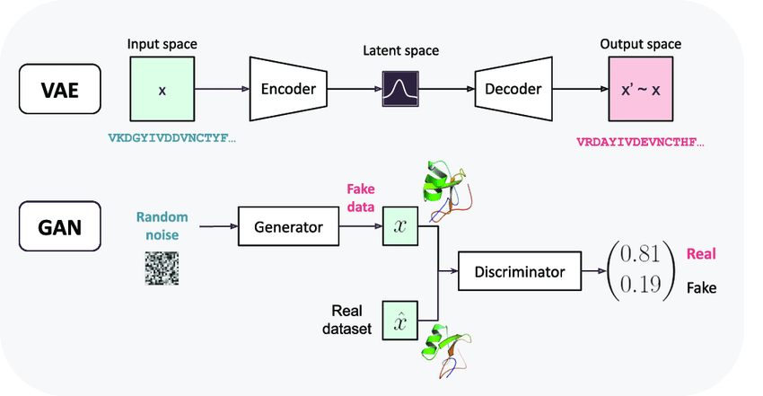

# TUD-CS4240-Deep-Learning


## 1 Activations and Backpropagation

### `Class Linear(in_features, out_features)`

__*PyTorch version: `nn.Linear`*__

- Fully-connected layer given by $y = x^T W + b$
- For a linear layer with $N_{in}$ and $N_{out}$ neurons, there are $N_{in} * N_{out}$ weights (connections) and $N_{out}$ biases
    - Input $x \in \mathbb{R}^{N_{in}}$, or typically in batches: $x \in \mathbb{R}^{batch, N_{in}}$
    - Output $y \in \mathbb{R}^{N_{out}}$ 
    - Weight matrix $W \in \mathbb{R}^{N_{in} * N_{out}}$ 

```python
    def init_params(self, std=1.):
        """
        Initialize layer parameters. Sample weight from Gaussian distribution
        and bias uniform distribution.
        
        Args:
            std: Standard deviation of Gaussian distribution (default: 1.0)
        """
```

```python
    def forward(self, x):
        """
        Forward pass of linear layer: multiply input tensor by weights and add
        bias. Store input tensor as cache variable.
        
        Args:
            x: input tensor

        Returns:
            y: output tensor
        """
```

```python
    def backward(self, dupstream):
        """
        Backward pass of linear layer: calculate gradients of loss with respect
        to weight and bias and return downstream gradient dx.
        
        Args:
            dupstream: Gradient of loss with respect to output of this layer.

        Returns:
            dx: Gradient of loss with respect to input of this layer.
        """
```


### Non-linear activation functions: `ReLU(x)` and `Sigmoid(x)`
- Similarly to regular linear layers, implement `def forward(x)` and `def backward(dupstream)`


### `Class Net(layers)`

__*PyTorch version: `TorchNet(in_features, hidden_dim, out_features)`*__
- *Does not take in layers, but initalizes those*
- *`nn.Parameter` can be used to load parameters from our model*

```python
 def reset_params(self, std=1.):
        """
        Reset network parameters. Applies `init_params` to all layers with
        learnable parameters.
        
        Args:
            std: Standard deviation of Gaussian distribution (default: 0.1)
        """
```

```python
def forward(self, x):
        """
        Performs forward pass through all layers of the network.
        
        Args:
            x: input tensor

        Returns:
            x: output tensor
        """
```

```python
def backward(self, dupstream):
        """
        Performs backward pass through all layers of the network.
        
        Args:
            dupstream: Gradient of loss with respect to output.
        """
```

```python
def optimizer_step(self, lr):
        """
        Updates network weights by performing a step in the negative gradient
        direction in each layer. The step size is determined by the learning
        rate.
        
        Args:
            lr: Learning rate to use for update step.
        """
```


## 2.1 CNNs

-  CNNs have far fewer parameters compared to fully-connected networks, which is beneficial for image data for instance: in which the individual pixels are the input neurons.
    - Rather than treating pixels that are far apart and close-by equally, we wanna have a more clever way of embedding the spatial structure! 

- Decrease in image size $\leftrightarrow$ increase in kernel size i.e. larger **receptive field (RF)** for neurons
    - Convolution increases RF linearly 
    - Pooling increases RF multiplicatively  

### `class Conv2d(in_channels, out_channels, kernel_size, stride, padding)`

_PyTorch version: `nn.Conv2d(in_channels, out_channels, kernel_size, stride, padding)`_

```python
    def init_params(self, std=0.7071):
        """
        Initialize layer parameters. Sample weight from Gaussian distribution
        and bias will be zeros.
        
        Args:
            std: Standard deviation of Gaussian distribution (default: 0.7071)
        """
```

``` python
    def forward(self, x):
        """
        Forward pass of convolutional layer
        
        Args:
            x: input tensor which has a shape of (N, C, H, W)

        Returns:
            y: output tensor which has a shape of (N, F, H', W') where
                H' = 1 + (H + 2 * padding - kernel_size) / stride
                W' = 1 + (W + 2 * padding - kernel_size) / stride
        """
```

```python
    def backward(self, dupstream):
        """
        Backward pass of convolutional layer: calculate gradients of loss with
        respect to weight and bias and return downstream gradient dx.
        
        Args:
            dupstream: Gradient of loss with respect to output of this layer.

        Returns:
            dx: Gradient of loss with respect to input of this layer.
        """
```


### `class MaxPool2d(kernel_size, stride, padding)`

_PyTorch version: `nn.MaxPool2d(kernel_size, stride, padding)`_

```python
 def forward(self, x):
        """
        Forward pass of max pooling layer
        
        Args:
            x: input tensor with shape of (N, C, H, W)
 
        Returns:
            y: output tensor with shape of (N, C, H', W') where
                H' = 1 + (H + 2 * padding - kernel_size) / stride
                W' = 1 + (W + 2 * padding - kernel_size) / stride
        """
```

```python
    def backward(self, dupstream):
        """
        Backward pass of max pooling layer: calculate gradients of loss with
        respect to weight and bias and return downstream gradient dx.
        
        Args:
            dupstream: Gradient of loss with respect to output of this layer.
 
        Returns:
            dx: Gradient of loss with respect to input of this layer.
        """
```


### `class CNN(in_channels, hidden_channels, out_features)`

_PyTorch version: `nn.TorchCNN(in_channels, hidden_channels, out_features)`_

```python
def forward(self, x):
    """
    Forward pass of CNN: chains inputs and outputs
    """
```


## 2.2 Optimization Algorithms

- **Stochastic Gradient Descent (SGD)** tends to be noisy! We need a memory-efficient way of computing gradients based on past statistics (averaging leads to smoother trajectories)!

- **EWMA: Exponentially Weighted Moving Average**: due to recursion, we only need to store $2n$ values given $n$ derivative values - one for each previous value.
    - $S_t = \rho S_{t-1} + (1 - \rho) y_t$ 

Some Gradient Descent Update algorithms that make use of EWMA:
- **Momentum**: on average in good direction - uses average to update gradient directly
- **RMSProp**: high variance in wrong direction - uses average to scale learning rate of update such that we take larger steps towards beginning
- **Adam**: combines **Momentum** and **RMSProp**


## 3.1 Regularization

### Learning Curves

- The more training data, the better you approcimate the true data distribution i.e. the closer to the asymptotic error you get
    - The more complex the model, the lower asymptotic error rate you can achieve - but only if you have sufficient training data!
    - For Bayes error (= irreducable error), you need inf no. of samples in order to see any learning.
    - Note: the curve can never be lower than Bayes error
- **"Appropriate" no. of training samples** = not perfect error rate, but at least similar to what you would expect on validation set
- **Underfitting** = potential to improve, but we don't see it directly in the learning curve until we tweak model complexity (params)


With regularization, learning curve flattens.

### Beating Overfitting

**Overfitting** occurs when there is a big gap between *true error* and *apparent error* - likely caused by a small training set hindering generalization of the model.
**Learning curve** plots training set size against accuracy.

Ways to beat overfitting:
- Data augmentation 
- *Reduce the no. of features*
- *Reduce complexity/flexibility of the model*

This is where **regularization** comes in: it discourages overly complex models (last 2 bullet points)!

*"Regularization are techniques to reduce the test error, possibly at the expense of increased training error"*


### Parameter Norm Regularization

Idea: *generalization bounds* is positively correlated with size of weights! Hence, we prefer smaller weights.s

**Ridge (L2) = weight decay**: shrinks coefficients of less significant features towards 0

$$\mathcal{L} = \mathcal{L}_0 + \frac{\lambda}{2}\sum_w w^2 $$

In the training loop, we can update the original loss e.g. *CrossEntropyLoss*:
```python
l2 = 0
for p in net.parameters():        # Loop through the network parameters
    l2 += torch.pow(p, 2).sum() 
loss = loss + 0.5 * wd * l2
```
Instead, we can also directly use the PyTorch weight decay parameter when instantiating optimizer:

```python
optimizer = optim.SGD(net.parameters(), lr=5e-1, weight_decay=3e-3)
```


- **Lasso (L1)**: reduce weights to exactly 0 (induces 
sparsity), performs feature selection during training NN

### Early Stopping (of Gradient Updating)

This also relies on the idea that smaller norm weights are preferred.

- **Weight space**: note there are flat areas (hardly any gradient) which may prevent model from learning
    - For each step, the loss landscape can look completely different! Also between true and apparent error, you may see learning or nothing happening...
    - VERY high dimensional and typically look terrible...
    - **Learning rate / no. of epochs** are hyperparams that are important to tune! 

- Useful when network is correctly initialized 
- We stop training when discrepancy between validation and apparent error starts to increase: decreasing error on train set may make it seem like model is learning still, whereas validation set (unseen) error increasing...
    - e.g. use **patience** as stopping criteria 
- This ensures norm of `w` is not too large (starting with small weights is good)
- Better generalization to future data

```python
if val_acc > val_acc_best:
    val_acc_best = val_acc
    patience_cnt = 0
else:
    patience_cnt += 1
    if patience_cnt == patience:
        break
```

### Noise Robustness
- Noise added to input - data augmentation
- Noise added to weights - encourages stability of model
- Noise added to output - label smoothing 

### Dropout
= combination of weight decay and noise injection or "forcefully set weights to 0"

- Note that this modifies the *architecture*, rather than a simple modification to the optimization step.
- Each training step: randomly select a fraction of the nodes and make then inactive (set to 0) 
- Prevents NN to become overly reliant on specific neurons i.e. smaller risk of overfitting
- You get different versions of network - all simultaneously trained

In `forward(x)` we can apply dropout: 
```python
h = F.relu(self.fc1(x))  
h = self.do1(h + F.relu(self.fc2(h)))
h = h + F.relu(self.fc3(h))
h = self.do2(h + F.relu(self.fc4(h)))
h = h + F.relu(self.fc5(h))
```

Note that during evaluation, we do not drop neurons but rescale weights: $w_{new} = w_{original} * p_{dropout}$


## 3.2 RNNs

- **Recurrent Neural Networks** can deal with inputs of varying lengths
- Weights are shared across the hidden states
- The no. of parameters does not grow with sequence length!
- A token $X_t$ (part of input sequence) must have the same dimension every iteration!

## Vanilla RNN (Elman)

```python
self.weight_xh = nn.Parameter(torch.Tensor(input_size, hidden_size))
self.weight_hh = nn.Parameter(torch.Tensor(hidden_size, hidden_size))
self.bias_xh = nn.Parameter(torch.Tensor(hidden_size))
self.bias_hh = nn.Parameter(torch.Tensor(hidden_size))
```

To deal with vanishing/exploding gradients, the **GRU** and **LSTM** were invented, which introduce additional gates.

## Gated Recurrent Unit (GRU)

- **Reset gate $R$**: possibly ignore previous hidden states $H_{t-1}$
- **Update gate $Z$**: weigh between previous hidden state $H_{t-1}$ and current candidate state $\hat{H}_{t}$

```python
# Below we concatenate the weight matrices W_xn, W_xr, W_xz since learning the reset gate, update gate and candidate state follow the same procedure (all rely on x_t and h_t-1)
self.weight_xh = nn.Parameter(torch.Tensor(input_size, 3 * hidden_size)) 
self.weight_hh = nn.Parameter(torch.Tensor(hidden_size, 3 * hidden_size))
self.bias_xh = nn.Parameter(torch.Tensor(3 * hidden_size))
self.bias_hh = nn.Parameter(torch.Tensor(3 * hidden_size))
```

## LSTM

- Linearly adds/removes information to 'memory cell'/'conveyor belt' $C_t$
- **Input- $I$ and forget $F$ gates**: similar to single update gate in GRU
- **Output gate $O$**: to compute the current hidden state

```python
self.weight_xh = nn.Parameter(torch.Tensor(input_size, 4 * hidden_size))
self.weight_hh = nn.Parameter(torch.Tensor(hidden_size, 4 * hidden_size))
self.bias_xh = nn.Parameter(torch.Tensor(4 * hidden_size))
self.bias_hh = nn.Parameter(torch.Tensor(4 * hidden_size))
```


## 4.1 Self-Attention / Transformers

Checkout https://peterbloem.nl/blog/transformers for details explanations and illustrations!
In this post, Transformers are defined as:

> Any architecture designed to process a connected set of units—such as the tokens in a sequence or the pixels in an image—where the only interaction between units is through self-attention.

- Whereas RNNs are not parallelizable by nature, Transformers are - making training much faster!
- Similarly as with RNNs, the no. of params does not grow as the sequence length increases!
- Trainable $k$ x $k$ weight matrices for Query, Key and Value vectors: $W_q, W_k, W_v$
    - Shared across layers, like with CNNs and RNNs
    - The "sliding window" in self-attention can be seen as sort of convolution, but Transformers are much better at capturing long-range dependencies

Self-attention layer with single head:

```python
class SelfAttention(nn.Module):
    def __init__(self, k):
    super(SelfAttention, self).__init__()

    # These layers compute the queries, keys and values
    self.tokeys    = nn.Linear(k, k, bias=False)
    self.toqueries = nn.Linear(k, k, bias=False)
    self.tovalues  = nn.Linear(k, k, bias=False)

    ...
```

*Wide multi-head self-attention*: i.e. each of the $h$ heads is applied independently, after which we project back to original dimensions. NOTE this does not lead to increase in params!

- Note that *Narrow multi-head self-attention* has less expressive power, since each head has reduced embedding dimension now.

```python
class MultiHeadAttention(nn.Module):
     def __init__(self, k, heads=8):
        super(MultiHeadAttention, self).__init__()

        self.heads = heads

        # These projections compute the queries, keys and values for all heads (as a single concatenated vector)
        self.tokeys    = nn.Linear(k, k * heads, bias=False)
        self.toqueries = nn.Linear(k, k * heads, bias=False)
        self.tovalues  = nn.Linear(k, k * heads, bias=False)

        # This unifies the outputs of the different heads into a single k-vector
        self.unifyheads = nn.Linear(k * heads, k)

        ...
```

Example of simple Transformer block:

```python
class TransformerBlock(nn.Module):
    def __init__(self, k, heads):
        """
        Basic transformer block.

        Args:
            k: embedding dimension
            heads: number of heads (k mod heads must be 0)
        """
        super(TransformerBlock, self).__init__()

        self.att = MultiHeadAttention(k, heads=heads)

        self.norm1 = nn.LayerNorm(k)

        self.ff = nn.Sequential(
            nn.Linear(k, 4 * k),
            nn.ReLU(),
            nn.Linear(4 * k, k))

        self.norm2 = nn.LayerNorm(k)

        ...
```

Finally, we typically also apply **positional encoding** to the Transformer architecture, to encode position to the input vectors i.e. avoiding permutation invariance.

Also note that in autoregressive tasks, we prevent Transformers by attending forward in the sequence by applying a mask.


## 4.2 Unsupervised Learning

Whereas supervised models learn the basis of examples, unsupervised learners mostly try to find meaning or structure within the data.

- Trained on non-labelled data (i.e. no targets), so tasks such as classification or regression become difficult
- Instead, unsupervised learners can be deployed as models that learn data-specific features, store large datasets efficiently or generate new realistic samples

<br>



<br>

### The Auto-encoder

Concatenation of two parts: $y = g(h(x))$
- **Encoder $h(x)$**: downscale data to *latent space* i.e. dimensionality reduction
    - Note that the latent dimension is a hyperparam 
- **Decoder $g(x)$**: decodes the lower-dimensional representation back to original size 
    - Used for generating new data: $x_{new} = h(z_{sample})$ 

Using $L(x, y)$ (i.e. MSE) we can learn how to encode the input signals and decode it back.

```python
class Encoder(nn.Module):
    def __init__(self, latent_dims, s_img, hdim):
        super(Encoder, self).__init__()
        self.linear1 = nn.Linear(s_img*s_img, hdim[0])
        self.linear2 = nn.Linear(hdim[0], hdim[1])
        self.linear3 = nn.Linear(hdim[1], latent_dims)
        self.relu    = nn.ReLU()
```

```python
class Decoder(nn.Module):
    def __init__(self, latent_dims, s_img, hdim):
        super(Decoder, self).__init__()

        self.linear1 = nn.Linear(latent_dims, hdim[1])
        self.linear2 = nn.Linear(hdim[1], hdim[0])
        self.linear3 = nn.Linear(hdim[0], s_img*s_img)
        self.relu    = nn.ReLU()
        self.sigmoid = nn.Sigmoid()
```

```python
class Autoencoder(nn.Module):
    def __init__(self, latent_dims, s_img, hdim = [100, 50]):
        super(Autoencoder, self).__init__()

        self.encoder = Encoder(latent_dims, s_img, hdim)
        self.decoder = Decoder(latent_dims, s_img, hdim)
```

Note it is tricky to generate samples here, due to the undefined range! 

### Variational Auto-encoders (VAEs)

- **Encoder**: generates *distributions*, instead of points! Sampling is part of training now.
    -  This new distribution is correct now i.e. we can throw away encoder and just use decoder to generate images 
    - Decoder-only setup: just make up a random $h$ and generate $r$ directly
- **Decoder**: chooses $z$ randomly from the learned distribution
    - Or: *reparameterization trick*:

$$
z = \mu_x +  \sigma_x \zeta= g_1(x) + g_2 (x) \zeta
$$

in which $\zeta$ is randomly sampled from $\mathcal{N} (0, I)$.  Backpropagation is perfectly possible again!

This yields a latent space that is:
- *Continuous*: two points close in latent space yield similar reproductions
- *Complete*: all points in the latent space, at least close enough to the origin, yield meaningful reproductions

NOTE: we only need to create a new encoder now, but the decoder remains identical:

```python
class VarEncoder(nn.Module):
    def __init__(self, latent_dims, s_img, hdim):
        super(VarEncoder, self).__init__()

        #layers for g1: learns mean
        self.linear1_1 = nn.Linear(s_img*s_img, hdim[0])
        self.linear2_1 = nn.Linear(hdim[0], hdim[1])
        self.linear3_1 = nn.Linear(hdim[1], latent_dims)

        #layers for g2: learns variance
        self.linear1_2 = nn.Linear(s_img*s_img, hdim[0])
        self.linear2_2 = nn.Linear(hdim[0], hdim[1])
        self.linear3_2 = nn.Linear(hdim[1], latent_dims)

        self.relu    = nn.ReLU()

        # distribution setup
        self.N = torch.distributions.Normal(0, 1)
        self.N.loc = self.N.loc.to(try_gpu()) # hack to get sampling on the GPU
        self.N.scale = self.N.scale.to(try_gpu())
        self.kl = 0
```

```python
class VarAutoencoder(nn.Module):
    def __init__(self, latent_dims, s_img, hdim = [100, 50]):
        super(VarAutoencoder, self).__init__()

        self.encoder = VarEncoder(latent_dims, s_img, hdim)
        self.decoder = Decoder(latent_dims, s_img, hdim)

    def forward(self, x):

        z = self.encoder(x)
        y = self.decoder(z)

        return y
```

We make some modifications to the loss function:

- By adding a regularization term to the loss, we try to make the network learn a normal distribution close to $N(0, 1)$.

$$
\begin{aligned}
f_{L} &= \underbrace{L (x, h(z))}_{\text{reproduction term}} + \underbrace{R \left(\mathcal{N} (\mu_x, \sigma_x), \mathcal{N} (0, I) \right)}_{\text{regularization term}} \\
&= L (x, h(z)) + R \left(\mathcal{N} (g_2 (x), g_1(x)), \mathcal{N} (0, I) \right)
\end{aligned}
$$

- We add a KL loss (regularization) term to the MSE loss: $L = L_{MSE} + L_{KL}$ to measure the loss between $N(0,I)$ and learned distribution where $L_{KL} = \sum{\sigma^2 + \mu^2 - log(\sigma) - 1/2}$

See the full derivation here: https://stats.stackexchange.com/questions/318748/deriving-the-kl-divergence-loss-for-vaes/370048#370048.

```python
    def kull_leib(self, mu, sigma):
        return torch.sum(sigma**2 + mu**2 - torch.log(sigma) - 1/2)
```

### Generative Adversarial Networks (GANs)

- **Discriminator**: tries to discrminate between real and fake data points
- **Generator**: learns to map points in the latent space to generated images - tries to fool the discriminator by generating real looking images

The latent space has no meaning other than the meaning applied to it via the generative model. Yet, the latent space has structure that can be explored, such as by interpolating between points and performing vector arithmetic between points in latent space which have meaningful and targeted effects on the generated images.
We can have 2 random noise vectors $z$ which can be morphed into each other through interpolation.

- Goal: train until **discriminator** cannot tell difference between fake and real anymore i.e. learn decoder to generate these images
    - At training time we know what is fake or real


## Useful PyTorch Operations

### Instantiating Tensors
- Default using FloatTensor: `self.weight_1 = torch.Tensor(in_feat, hidden_dims)`
- From Python list: `x_xor = torch.tensor([[0, 0], [0, 1], [1, 0], [1, 1]], dtype=torch.float32)`

### Matrix Multiplications
- `y = torch.mm(x, self.weight) + self.bias`
- Directly adding bias: `y = torch.addmm(self.bias_xh, x[0], self.weight_xh)`
- Operate on batches: `y = torch.bmm(...)`

### Tensor Manipulations
- Flatten input: `x = x.view(x.shape[0], -1)`

